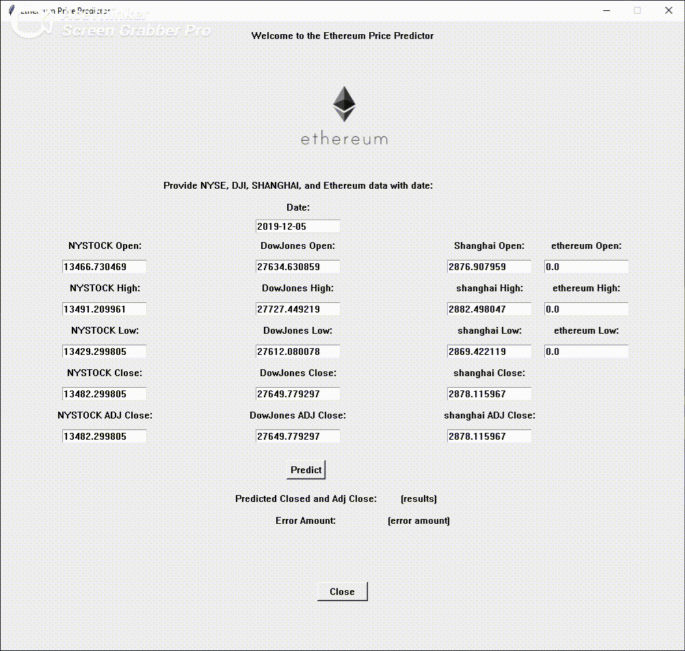

# ML Final Project Ethereum Predicter and Predictor App

## Christian Orellana | Machine Learning | Pratt Institute | December 2020

<p align="center">
  
</p>


## Purpose and Abstract


### On Monday March 9 2020, the history’s largest point plunge for the Dow Jones Industrial Average (DJIA) happened. A few days later, on March 12, leading cryptocurrency Bitcoin and Ethereum saw a crash drop in value at 50%.


### Many factors can describe the reasoning behind these crashes, which include the rapid spread of COVID-19, consumer fear, and mass stock and crypto sell offs. These heavy tolls on the U.S. economy and the U.S. stock market garners further research which inspired the purpose of this project, which was how can one implement machine learning and follow trends of the world economy to learn the outcome of a price on a given day with a Crypto Currency?

### This project will outline the procedure of creating a Polynomial Regression model as well as an App that can be used in a Windows OS environment that can take stock exchange sets of data and export the Closing and Adjust Closing Price of Ethereum assuming that one has the available data required on a given day.


## This project will compose of the following:

#### - Explanation of the ML Model used and other functions for Predicting Ethereum as well as the Datasets used for the ML Model
#### - A brief overview of a Tkinter App created for a Windows OS environment to easily calculate the predicted price of Ethereum


#### At the end of this readme file, the reader should be able to attain basic concepts of the Ethereum Price Predictor project as well as understand how to use the Tkinter Ethereum Price Predictor App

#### Please refer to the Notebook project file and the Python App Script here:

Notebook:
https://github.com/chrisatpratt/ML-Final-Project-Ethereum-Predicter/blob/main/Christian%20Orellana%20Final%20Project.ipynb


Python App
https://github.com/chrisatpratt/ML-Final-Project-Ethereum-Predicter/tree/main/app


## Ethereum, I'm watching you: Implementing Polynomial Regression onto 

### This project focuses on Ethereum as the main subject of the machine learning model. 

#### For this machine learning project I used polynomial regression. The reasoning behind this decision was to allow the machine learning model to adapt to the curving changes of the economy over time, instead of using typical linear regression models. 

### The datasets used were the following stock exchange data sets available here:


NYSE 
```
https://finance.yahoo.com/quote/%5ENYA
```


DowJones
```
https://finance.yahoo.com/quote/%5EDJI/history?p=%5EDJI
```


Shanghai Stock Exchange
```
https://finance.yahoo.com/quote/000001.SS/history
```

#### The aforementioned choices of Stock Exchange data were chosen under the pretext that Crypto Currency is heavily influenced by these major economy powers, The United States, and China. By using these three datasets, I was able to inject them into a combined dataset with the Ethereum data set to predict the possible price of a given day.

Ethereum
```
https://finance.yahoo.com/quote/ETH-USD/history/
```

### Functions and Methods used within the Notebook

#### Important functions that were needed to be created for this project were the following:

Conversion to Time Stamp Function: The datasets used came with a timestamp set as a string in Year-Month-Date format. In order to incorporate the datasets into the Polynomial Regression model, converting these strings was important.

The conversion was designed to set the timestamps to Epoch Time, or Time from Epoch.
```
def convert_to_timestamp_rm_volume(data):
    "This will convert the first column that is a data object to a date type and then convert it to a int object"
    data['Date'] = pd.to_datetime(data['Date']).dt.strftime("%Y%m%d")
    data['Date'] = pd.to_datetime(data['Date'], format = "%Y%m%d")
    data['Date'] = data['Date'].view('int64')
    data.drop(columns='Volume', axis = 1, inplace = True)
    return data
```

DataSet Merger Function: This function was designed to easily combine the datasets into one master dataset so that it can be used throughout the rest of the project.
```
def merger(data1, data2, data3, data4, column, method):
    "This will merge all the data sets into one dataset"
    data = pd.merge(data1, data2, on = column, how = method)
    data = pd.merge(data, data3, on = column, how = method)
    data = pd.merge(data, data4, on = column, how = method)
    return data
```

Predict function: The predict function was created to easily pass in a user input so that it can output the predicted value of Ethereum easily to a user. This function will have later be used in the Python app.
```
def predict_button(value):
    "This function will be used to prepare the input to a format that our polynomial model can understand"
    
    # Check to make sure that the input was 19 values in total
    assert value != 19
    
    # Convert the input into a dataframe
    value = pd.DataFrame(value)
    
    # Define the names of the columns
    value.columns = column_names_for_input
    
    # Convert the date column into a timestamp
    value['Date'] = pd.to_datetime(value['Date']).dt.strftime("%Y%m%d")
    value['Date'] = pd.to_datetime(value['Date'], format = "%Y%m%d")
    value['Date'] = value['Date'].view('int64')
    
    # Separate the date column and prepare the data for scaling
    value_date = value.iloc[:,0:1]
    value_nodate = value.drop(columns='Date', axis = 1)
    
    # Run scaling on the input and convert back to dataframe
    value_nodate_scaled = scaler.transform(value_nodate)
    value_nodate_scaled = pd.DataFrame(value_nodate_scaled)
    
    # Put back the date column and rename the columns 
    value_withdate_scaled = value_nodate_scaled
    value_withdate_scaled['Date'] = value_date
    date = value_withdate_scaled['Date']
    value_withdate_scaled.drop(columns='Date', axis = 1, inplace = True)
    value_withdate_scaled.insert(0, 'Date', date)
    value_withdate_scaled.columns = column_names_for_input
    
    return poly_model.predict(pft.fit_transform(value))
```

#### After merging and preparing the data, it was important to also look out for any missing values for dates between the various data sets. Also, since plenty the values the model was going to use are very large numbers a scaler was used to adjust the values that will be inputed into the ML model.

Imputer (guessdata is the name of the master data set with all files merged together)
```
imputer = SimpleImputer(missing_values=nan, strategy='mean')
guessdata_nodates = imputer.fit_transform(guessdata_nodates)
```

Scaler
```
scaler = StandardScaler()
scaler.fit(guessdata_nodates.iloc[:,0:18])
guessdata_nodates_scaled = scaler.transform(guessdata_nodates.iloc[:,0:18])
```
## Calculating Error

#### Polynomial Regression uses an order of degrees that sets the power of the features to the number of degrees, outputting more data than the input, which can then be used to predict our Ethereum price. 

#### To calculate my error I designed a for loop that iterates through a range of values and for each value that is iterated it is passed through the Polynomial model to specify the order of degrees.

```
degree, error_quantity = list(), list()
for i in range(1, 7): 
    pft = PolynomialFeatures(degree = i)
    X_poly = pft.fit_transform(x)
    X_poly = pd.DataFrame(X_poly)
    X_train, X_test, y_train, y_test = train_test_split(X_poly, y, test_size = 0.3, random_state = 42)
    poly_model = linear_model.Ridge(alpha = 400)
    redge2 = Ridge(alpha = 400)
    
    poly_model.fit(X_train, y_train)
    # Predict and determine the mean squared error of the polynomial regression model
    y_pred = poly_model.predict(X_test)
    error = mean_squared_error(y_test, y_pred)
    degree.append(i)
    error_quantity.append(error)
```
#### By calculating the Mean Squared Error for my regression model for each value of order of degrees, I am able to export and append the error to a list that I can use to plot.

#### Through this method, I was able to understand which order of degrees was the most efficient for my Polynomial Regression model, which I plot out below:

## The Order of Degrees: 2


#### As it can be seen above, the best order of degrees was 2 for my model, which is typically the default order of degrees for a base polynomial regression model. A linear regression model which typically has an order of 1 degree has more error than a order degree of 2 polynomail regression model. Anything past two would increase my error output.

## Here comes the money: Implementing my model into an App


### In order to create my app I used the Tkinter library that can be used to create an adaptable GUI in an OS environment. 

#### As you can see below as proof of concept, the app can receive input from a User which then can be used to predict the Price of Ethereum, while also exporting the error amount. 

#### Here the Predict function mentioned earlier comes into play and runs in the background that expects an input from the user.



#### The app will require in total 19 inputs that can be found by retrieving the following through any source of Stock Exchange outlets:

#### For testing, a test.txt file was provided for the app with a test date and values for the inputs.

Date (in Year-Month-Day Format)

Open, High, Low, Close, Adj for NYSE, DOWJONES, and SHANGHAI

Open, High, Low for Ethereum

### The expected output of the App will be displayed by the lower bottom for the Closing Price and the Adjusted Closing Price of Ethereum.


## For Tkinter documentation:

https://docs.python.org/3/library/tkinter.html


The Tkinter package is based off from the 3.8 Python package, which would require an update if your machine has an older Python version.

